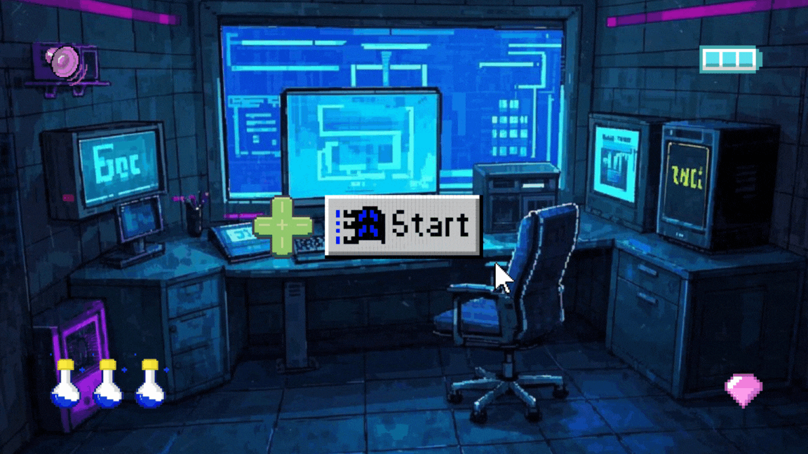

# 🍹Safphere

> **To spark, often burst in hard stone.**

## Introduction

我们的组织致力于探究 `人工智能` 及 `信息安全` 相关的技术，并不断为行业提供创新的技术方案。我们通过参与各类竞赛、举办研讨会、组织会议以及开展项目合作等方式，持续提升自己的技术能力，并不断创造出可靠、安全且具有高效性能的技术产品。

目前，我们的研究领域尤其关注以下几个方向：

+ 🎀 **机器学习与深度学习**

+ 🧂 **网络安全与威胁情报**

+ 🚓 **隐私保护 AI**

+ 🎡 **伦理 AI 与算法公平性**

+ 🎈 **安全云计算**

## Models / Programmes

+ Savant4RedT

## Honor

Coming soon...

## Media Accounts

Coming soon...
